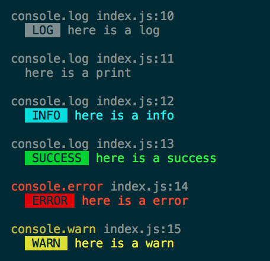

# @ycm.jason/logger

Display log with styles.



## Install

```
npm i --save @ycm.jason/logger
```

## Usage

```js
const logger = new require('@ycm.jason/logger')({ silent: false });

logger.clear();                // clear console
logger.log('hello world');     // LOG hello world (grey)
logger.print('hello world');   // hello world
logger.info('hello world');    // INFO hello world (cyan)
logger.success('hello world'); // SUCCESS hello world (green)
logger.error('hello world');   // ERROR hello world (red)
logger.warn('hello world');    // WARN hello world (yellow)
```

## Test

```
npm t
```

## Author

Jason Yu (me@ycmjason.com)
